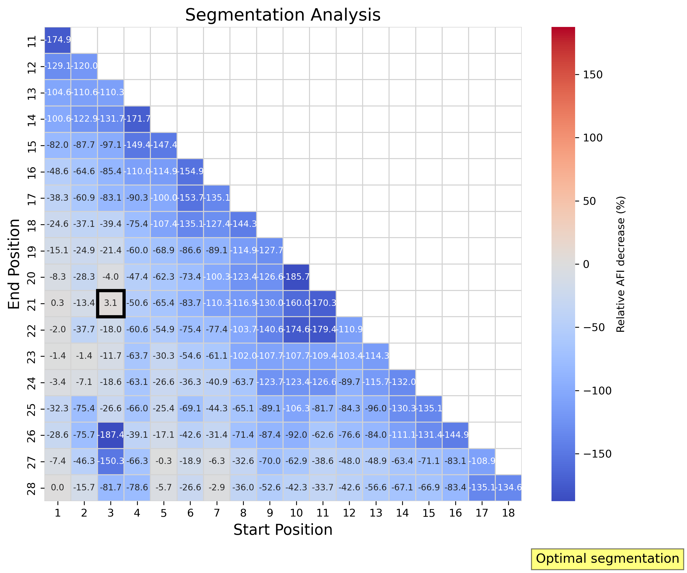
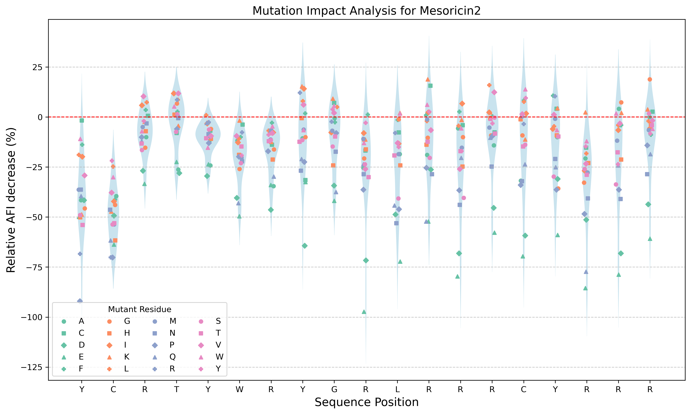

# Mesoricin Design and Optimization
This repository documents the computational design of mesoricin, a short antifungal peptide derived from *Mesorhizobium sp.*. Mesoricin features a dual-domain structure: an α-helix domain responsible for membrane disruption and a β-sheet domain that targets intracellular energy production. The optimization process aims to enhance antifungal activity while minimizing cytotoxicity. The optimization involves three computational steps guided by the Antifungal Index (AFI), an *in silico* metric that integrates machine learning-predicted minimum inhibitory concentrations (MICs) for multiple representative fungal species.

## Project Overview

### Project Structure

- **`mesoricin_design.py`**: The primary script orchestrating the mesoricin design process.
- **`visualize_design_results.py`**: A script to visualize the exhaustive segmentation and single point mutation on the predicted antifungal activity (AFI) of mesoricin1 and mesoricin2, respectively. This script performs an exhaustive in silico scan, generating a plot that highlights positions and amino acid substitutions yielding the most significant enhancements in predicted activity.
- **`AF_Cluster/`**: This directory contains data related to the predicted structural distribution of all four mesoricin variants, along with dimensionality reduction visualizations.

### Design Workflow

The mesoricin optimization workflow encompasses three key stages:

1.  **Segmentation:** Partitioning the initial mesoricin sequence (mesoricin1) into smaller peptides to identify the most active segment.
2.  **Single-Point Mutation:** Implementing targeted single amino acid substitutions in the most active segment to further enhance activity.
3.  **Global Optimization:** Performing global sequence optimization to achieve an optimal balance between antifungal efficacy and biosafety.

### Key Features

- ***In Silico* Metric**: The Antifungal Index (AFI) serves as a quantitative, structure-activity based metric for guiding peptide optimization. By considering antifungal activity while reducing hemolytic and cytotoxic effects, AFI enables a comprehensive in silico assessment for the overall optimization of peptide antifungal activity [1,2].
- **Potential Benefits**: The AFI is parameterized using publicly available experimental data on antimicrobial peptides. Peptides designed using AFI are expected to exhibit not only lower MICs but also additional desirable characteristics such as high fungicidal activity, potent microbial biofilm inhibition and eradication, stability under extreme conditions, a low propensity for inducing microbial resistance, and minimal hemolytic and cytotoxic effects.
- **Cross-Activity**: Owing to the intrinsic correlation between antimicrobial activities, the AFI framework can also be effectively applied for screening antibacterial peptides.

### Usage Instructions
To utilize this project:

1. **Set up the environment**:
    ```bash
    git clone https://www.github.com/JinZhangLab/mesoricin_design.git
    cd mesoricin_design
    conda env create -f environment.yml
    conda activate mesoricin_env
    ```
2. **Run the design script**:
    ```bash
    python ./mesoricin_design.py
    ```

By executing the `mesoricin_design.py` script, it generates the following mesoricin variants:

*   **Mesoricin1:** `RRYCRTYWRYGRLRRRCYRRRVWIWFRL` (Initial sequence)
*   **Mesoricin2:** `YCRTYWRYGRLRRRCYRRR` (Segmented sequence)
*   **Mesoricin3:** `YCRTYWRYGRLKRRCYRRR` (Single-point mutant)
*   **Mesoricin4:** `YCRIYWRHGRLKRRCFRRG` (Globally optimized sequence)

### Design Results
By executing the `visualize_design_results.py` script, you can generate the following results:

#### Segmentation Results


**Figure 1.** Exhaustive segmentation of mesoricin1. The plot illustrates the impact of each segment on the predicted antifungal activity (AFI) of mesoricin1. The x-axis denotes the position of the segment, while the y-axis represents the relative AFI decrease ratio. Segments resulting in a larger decrease in AFI indicate more critical positions and more promising substitutions for enhancing antifungal activity.

#### Single-Point Mutation Results


**Figure 2.** Exhaustive *in silico* mutagenesis of mesoricin2. The plot illustrates the impact of each mutation on the predicted antifungal activity (AFI) of mesoricin2. The x-axis denotes the position of the mutation, while the y-axis represents the relative AFI decrease ratio. Mutations resulting in a larger decrease in AFI indicate more critical positions and more promising substitutions for enhancing antifungal activity.

#### Structural Distribution


**Figure 3.** Predicted 3D structures of mesoricins. (A) t-distributed Stochastic Neighbor Embedding (t-SNE) plot visualizing the structural relationships among mesoricin 1–4. The plot was generated based on pairwise TM-scores calculated from structures of mesoricin 1–4, all generated using AF-Cluster. The cluster of mesoricin1 diverged from mesoricin 2-4, while mesoricin 2-4 exhibit tight clustering, suggesting a conserved structural motif. (B) Whole structures of Mesoricin 1-4 derived from AF-Cluster. Mesoricin 1 exhibits two distinct conformational states: one characterized by an α-helix and anti-parallel β-sheet architecture, and another featuring a random coil and β-sheet fold. The α-helix domain is highlighted in red, the β-sheet domain in yellow ribbons, and the random coil in green lines. The N- and C-termini are labeled to indicate structural orientation.

## References

1. H. Zhao, et al. Activity and Safety Optimization of Mesoricin: A Dual-Domain Antifungal Peptide from Mesorhizobium sp. J. Med. Chem., 2025, 68, 8, 8226–8243. DOI: 10.1021/acs.jmedchem.4c02917.
2. J. Zhang, et al. In Silico Design and Synthesis of Antifungal Peptides Guided by Quantitative Antifungal Activity. J. Chem. Inf. Model., 2024, 64 (10): 4277-4285. DOI: 10.1021/acs.jcim.4c00142.
3. J. Zhang, et al. Large-Scale Screening of Antifungal Peptides Based on Quantitative Structure-Activity Relationship. ACS Med. Chem. Lett., 2022, 13(1): 99-104. DOI: 10.1021/acsmedchemlett.1c00556.

## License

This repository is distributed under the MIT License.


## Stay Updated

For the latest advancements in antimicrobial peptide design and applications, follow our WeChat Official Account!


## Contact

For further inquiries, please contact:
- **Email:** jzhang@gmc.edu.cn
